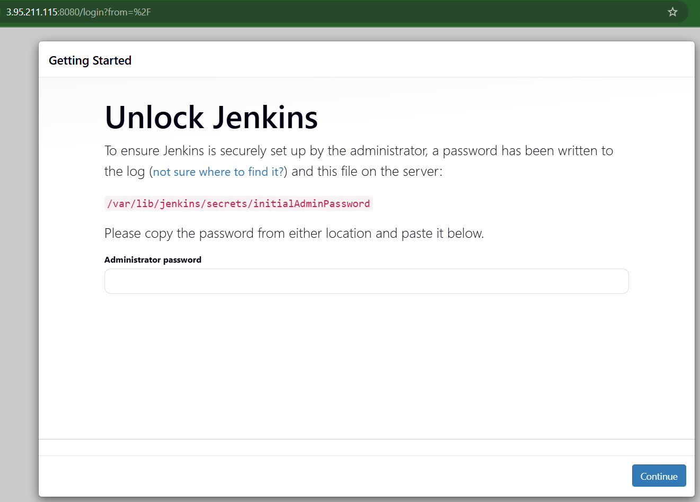
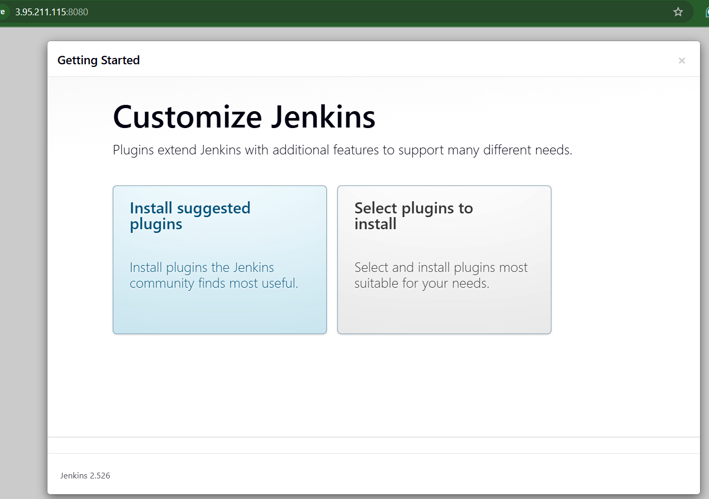
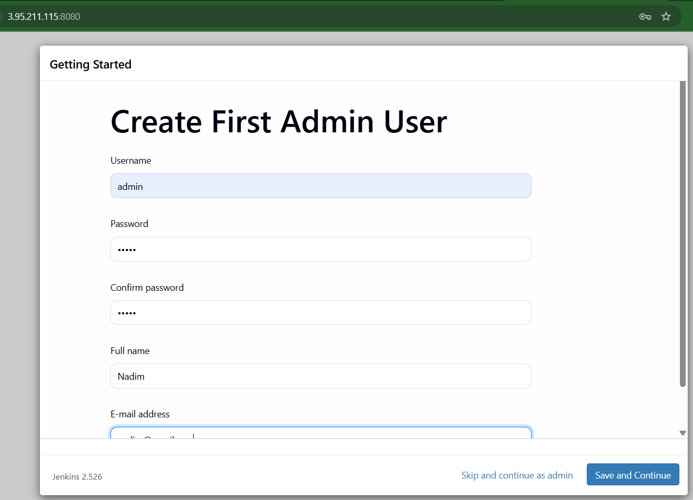
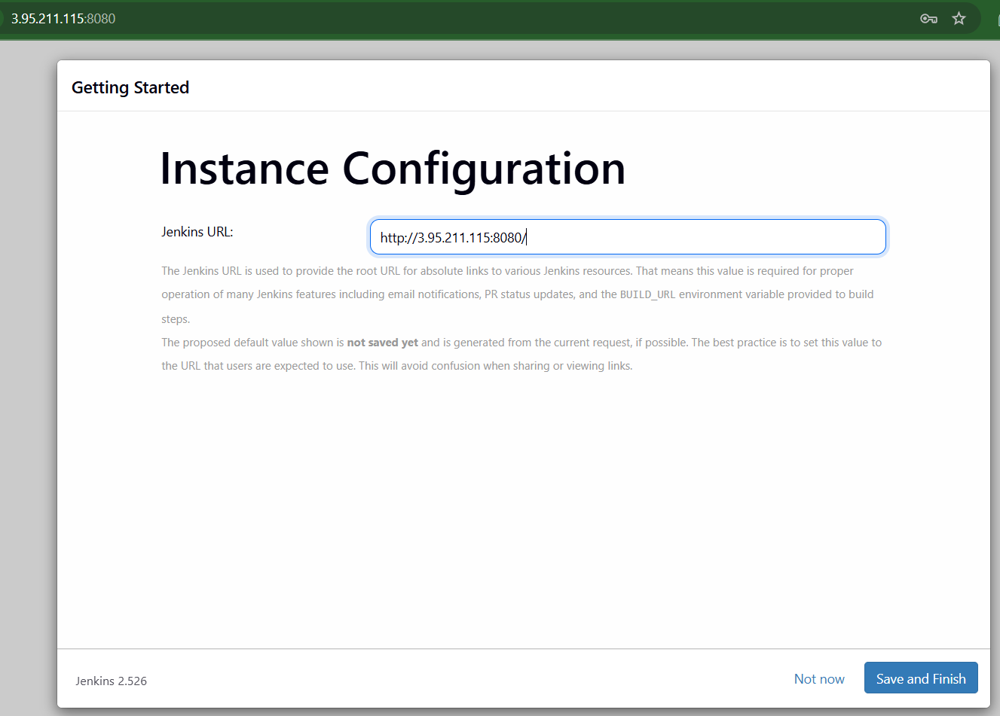
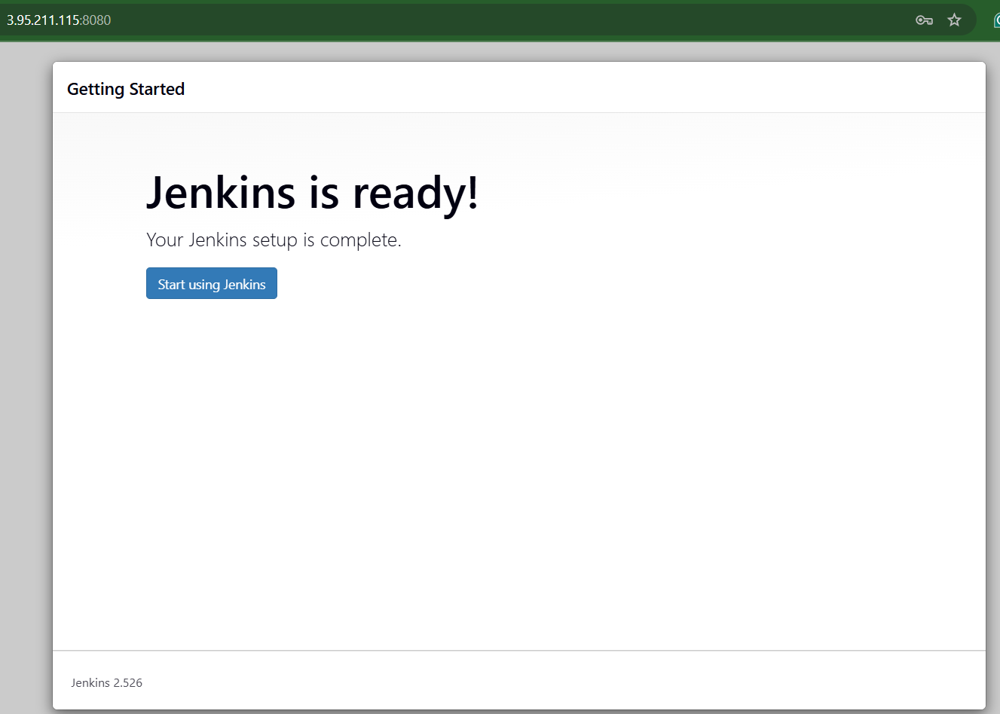
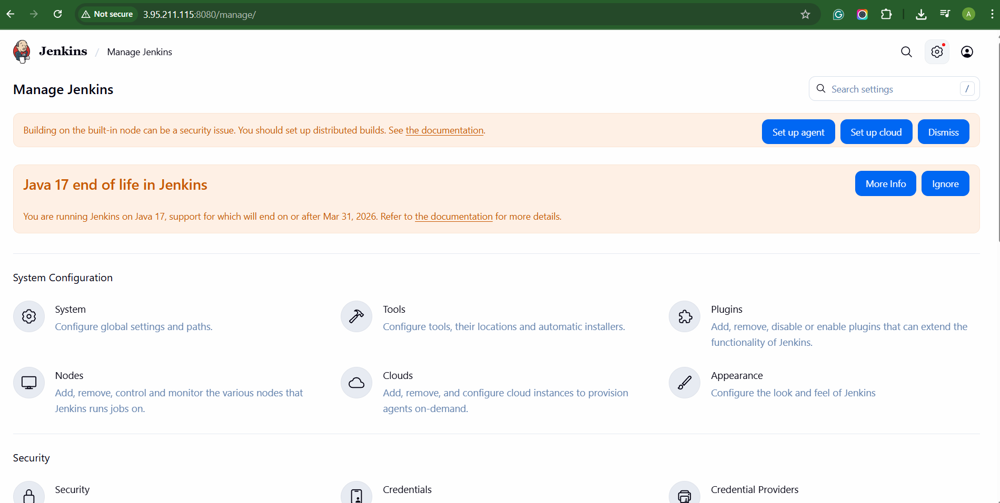
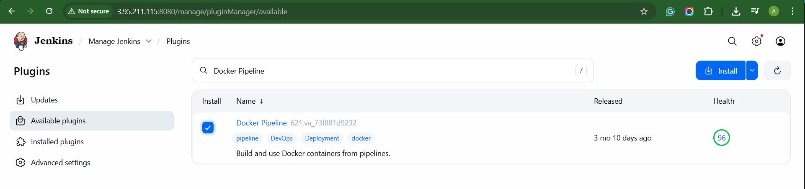
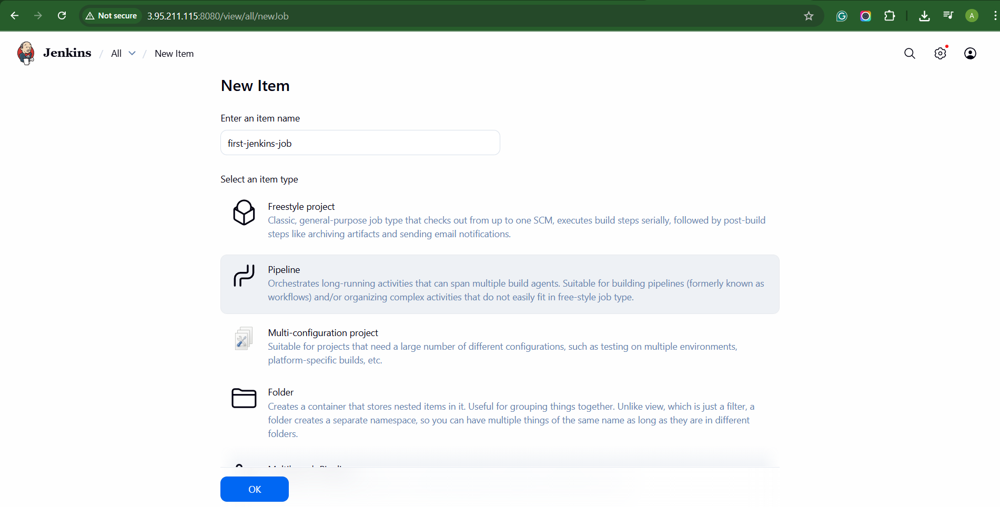
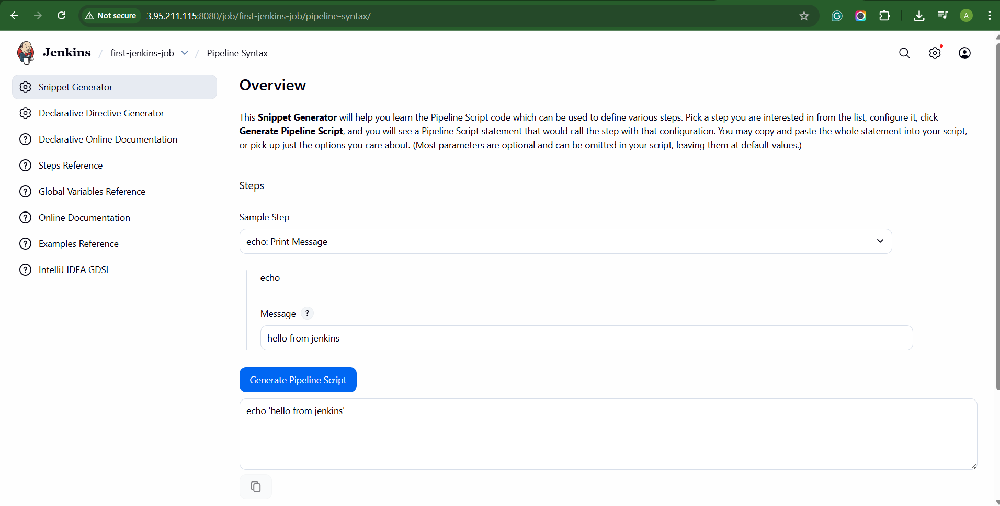

# Jenkins

CI/CD => https://www.jenkins.io/doc/book/resources/pipeline/realworld-pipeline-flow.png

```
sudo apt update
sudo apt install openjdk-17-jre
```

```
java -version
```

```
curl -fsSL https://pkg.jenkins.io/debian/jenkins.io-2023.key | sudo tee \
  /usr/share/keyrings/jenkins-keyring.asc > /dev/null
echo deb [signed-by=/usr/share/keyrings/jenkins-keyring.asc] \
  https://pkg.jenkins.io/debian binary/ | sudo tee \
  /etc/apt/sources.list.d/jenkins.list > /dev/null
sudo apt-get update
sudo apt-get install jenkins
```

```
ps -ef | grep jenkins
```

```
sudo cat /var/lib/jenkins/secrets/initialAdminPassword
```


```
sudo apt update
sudo apt install docker.io
```

```
sudo su - 
usermod -aG docker jenkins
usermod -aG docker ubuntu
systemctl restart docker
```

```
su - jenkins
docker run hello-world
```

## UI Setup



















