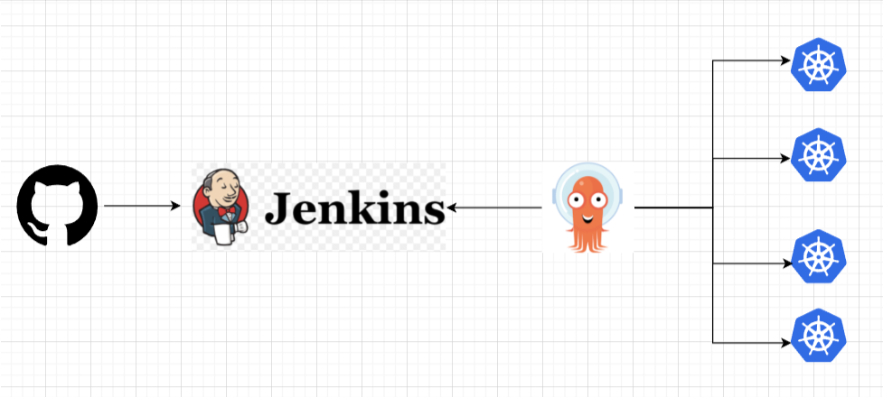

# django-todo
A simple todo app built with django


```
git clone https://github.com/aa-nadim/jenkins-cicd/
cd jenkins-cicd/python-jenkins-argocd-k8s
```

```
python manage.py makemigrations
python manage.py migrate
python manage.py createsuperuser
python manage.py runserver
```

live => http://127.0.0.1:8000/todos 

## CICD Architecture [GitHub -> Jenkins -> k8s Manifests -> Argo CD -> k8s cluster]




